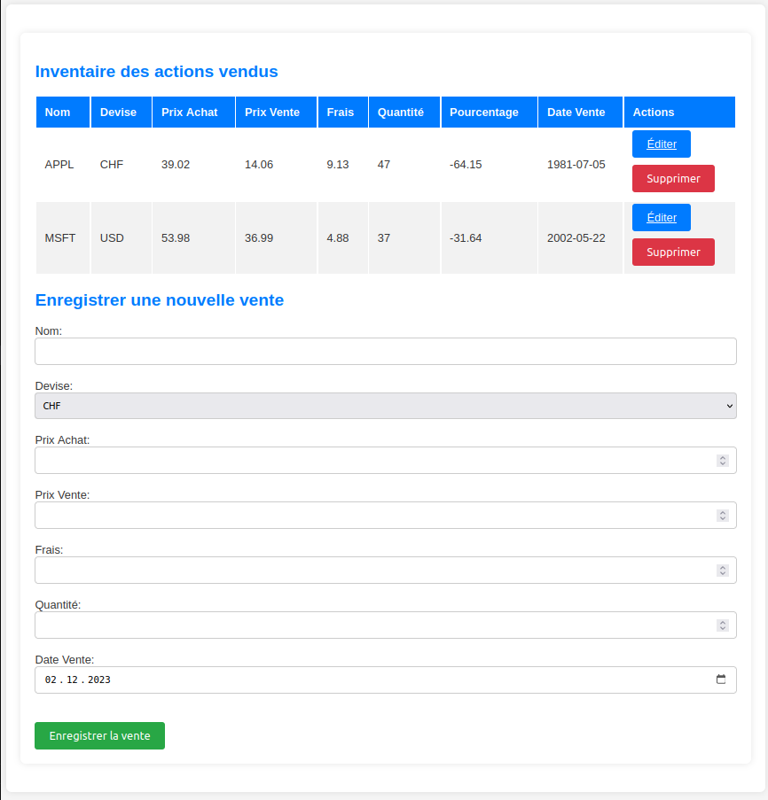

<p align="center"><a href="https://laravel.com" target="_blank"></a></p>

<p align="center">
<a href="https://github.com/laravel/framework/actions"></a>
<a href="https://packagist.org/packages/laravel/framework"></a>
<a href="https://packagist.org/packages/laravel/framework"></a>
<a href="https://packagist.org/packages/laravel/framework"></a>
</p>

# WEB-WORK2

Ce projet est une application web pour gérer un inventaire d'actions vendues. Il est construit à l'aide de laravel, et utilise Docker pour l'environnement de développement.



## Prérequis

- Docker
- Docker Compose

## Installation

Clonez ce dépôt sur votre machine locale :

```bash
git git@github.com:apirakas/WEB-WORK2.git
```

Construisez et démarrez les conteneurs Docker :

```bash
docker-compose up -d
```

## Utilisation

Pour démarrer l'application, utilisez la commande suivante :

```bash
docker exec nom_du_conteneur_web php artisan serve
```
Ouvrez votre navigateur web et accédez à http://localhost:8000 pour voir l'application en action.


Pour peupler la base de données avec des données de test, utilisez la commande suivante :
> [!IMPORTANT]  
> Toutes les devises sont autorisées mais c'est uniquement pour un exmeple de fonctionnement de l'application.

```bash
docker exec nom_du_conteneur_web php artisan db:seed --class=ActionsTableSeeder
```

Fonctionnalités
- Affichage d'un inventaire de ventes d'actions
- Ajout de nouvelles ventes d'actions
- Modification de ventes d'actions existantes
- Suppression de ventes d'actions

Commandes utilisées
# Télécharger laravel
curl -s "https://laravel.build/WEB-WORK2?with=mysql&devcontainer" | bash
# Démarrer les conteneurs
cd WEB-WORK2 && docker compose up -d
# Créer un le fichier pour la base de données
docker exec web-work2-laravel.test-1 php artisan make:migration create_actions_table
# Après avoir rempli le fichier créer la base de données
docker exec web-work2-laravel.test-1 php artisan migrate
# supprime et création de la base de données
# docker exec web-work2-laravel.test-1 php artisan migrate:fresh
# Créer un model
docker exec web-work2-laravel.test-1 php artisan make:model Action
# Créer un controller
docker exec web-work2-laravel.test-1 php artisan make:controller ActionController
# Après avoir créer le model et le controller, ajouter les routes dans le fichier web.php puis lancez le serveur
docker exec web-work2-laravel.test-1 php artisan serve

# Créer un factory et un seeder pour peupler la base de données
docker exec web-work2-laravel.test-1 php artisan make:factory ActionFactory --model=Action
docker exec web-work2-laravel.test-1 php artisan make:seeder ActionsTableSeeder
docker exec web-work2-laravel.test-1 php artisan db:seed --class=ActionsTableSeeder


